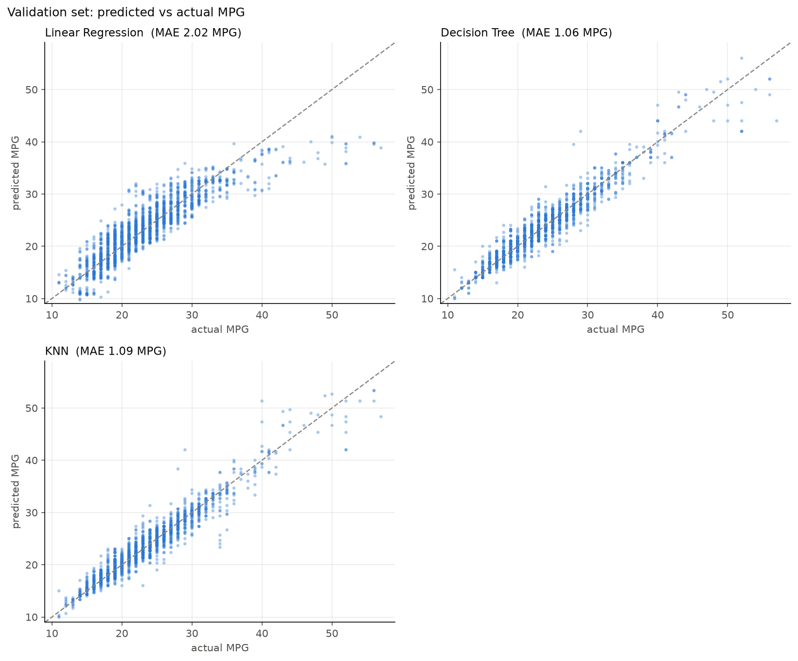
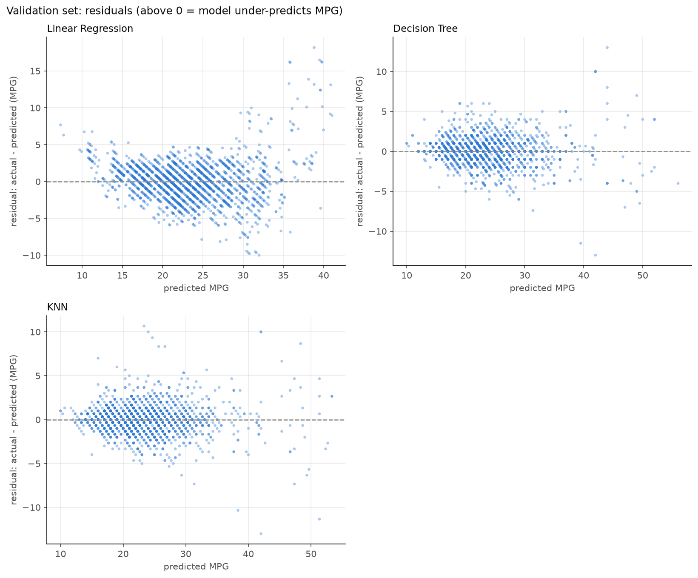
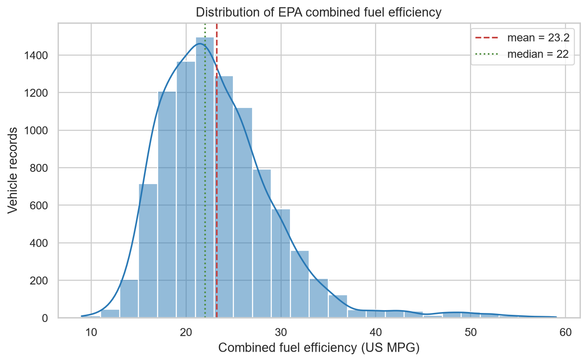
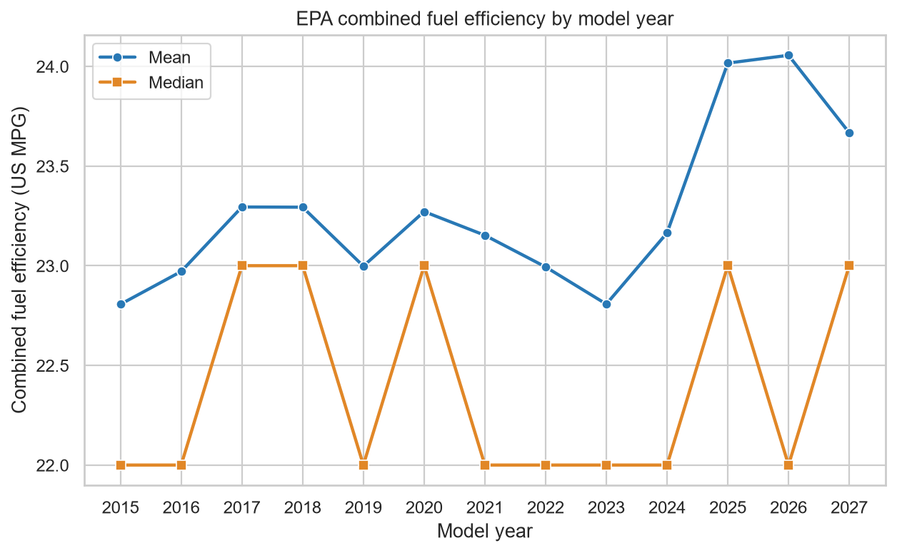
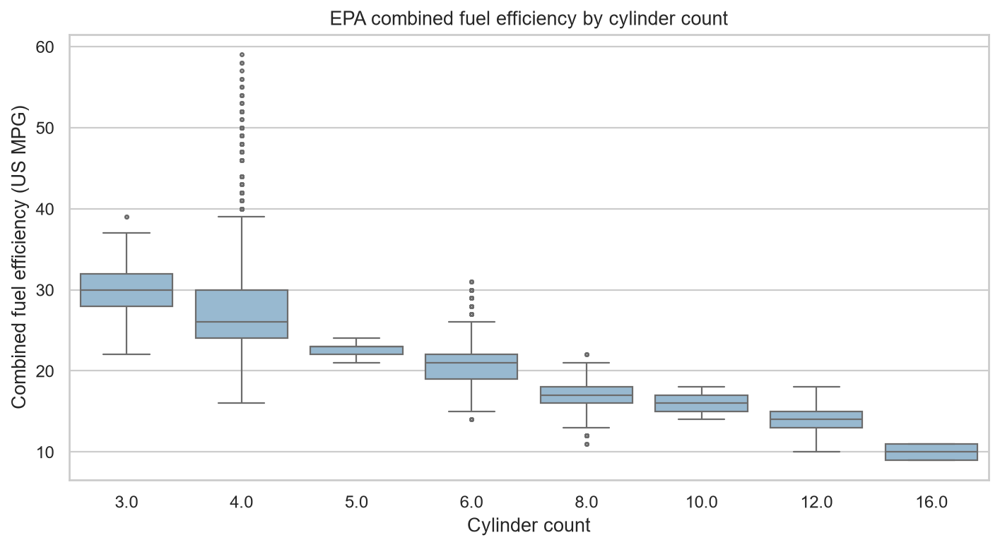
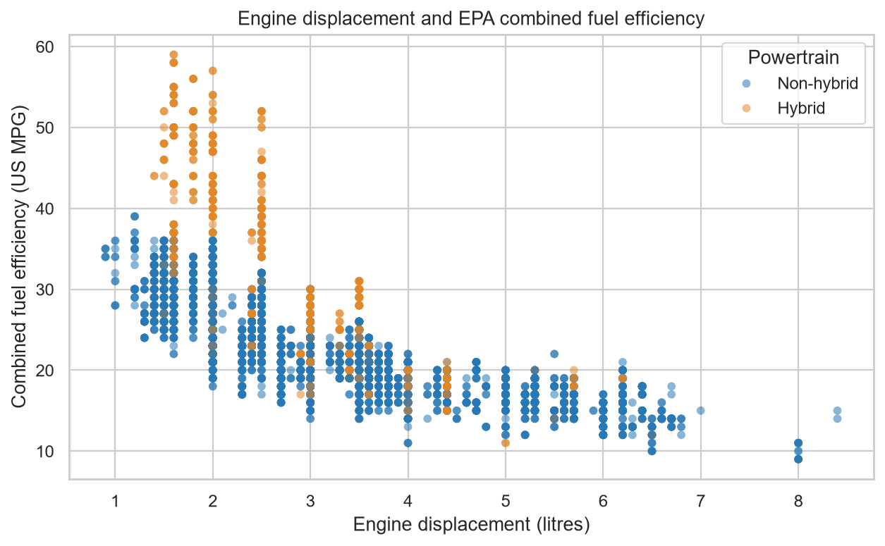

# Vehicle Fuel Efficiency Prediction

Predicting the EPA combined fuel efficiency (MPG) of recent vehicles from their specifications. This is a supervised regression project built on public FuelEconomy.gov data.

**Result:** the tuned Decision Tree predicts combined MPG on the held-out test set with **MAE 1.04 MPG** (RMSE 1.67, R² 0.93). That is about 4.5× better than predicting the mean (validation MAE 4.66).

## Project question

Can we predict the EPA combined fuel efficiency of a recent vehicle from its specifications?

- **Target:** `comb08`, EPA combined US miles per gallon. Higher means more efficient.
- **Task:** supervised regression.
- **Primary metric:** mean absolute error (MAE) in MPG. An MAE of 2 means predictions are off by 2 MPG on average.
- **Secondary metrics:** RMSE (MPG) and R² (unitless).

## Results

All models use the same seed-42 split and the same preprocessing pipeline, including the engineered `displacement_per_cylinder` feature. Hyperparameters were tuned with 5-fold grouped cross-validation on the training split only. The final model was selected by validation MAE.

### Validation comparison (n = 2,080)

| Model | Tuned hyperparameters | CV MAE (train, 5-fold) | Val MAE | Val RMSE | Val R² |
|---|---|---|---|---|---|
| **Decision Tree** | `max_depth=None`, `min_samples_leaf=1` | 1.090 ± 0.024 | **1.059** | 1.691 | 0.926 |
| KNN | `n_neighbors=3`, `p=1`, `weights=uniform` | 1.112 ± 0.033 | 1.093 | 1.665 | 0.928 |
| Linear Regression | – | 1.986 ± 0.036 | 2.019 | 2.778 | 0.799 |
| Baseline (mean) | – | 4.635 ± 0.067 | 4.662 | 6.197 | 0.000 |

Search spaces: Decision Tree, 24 candidates (`max_depth` ∈ {4, 6, 8, 10, 12, None} × `min_samples_leaf` ∈ {1, 5, 10, 20}); KNN, 20 candidates (`n_neighbors` ∈ {3, 5, 10, 15, 25} × `weights` × `p` ∈ {1, 2}). Full grids are in [`reports/results/decision_tree_tuning.csv`](reports/results/decision_tree_tuning.csv) and [`reports/results/knn_tuning.csv`](reports/results/knn_tuning.csv).

### Final test evaluation (n = 2,079)

| Model | Test MAE | Test RMSE | Test R² |
|---|---|---|---|
| Decision Tree | **1.038** | 1.668 | 0.928 |

The test split was evaluated **once**, after the model choice was fixed ([`reports/results/final_test.json`](reports/results/final_test.json)). The test score matches validation (1.04 vs 1.06 MPG), so the model generalises to unseen vehicles.

### Error analysis

| Actual vs predicted (validation) | Residuals (validation) |
|---|---|
|  |  |

Error broken down by vehicle class and the largest individual errors are saved in [`error_by_vehicle_class_validation.csv`](reports/results/error_by_vehicle_class_validation.csv) and [`largest_errors_validation.csv`](reports/results/largest_errors_validation.csv). The integrated discussion is in [`notebooks/project.ipynb`](notebooks/project.ipynb).

## Dataset

The data is the public U.S. EPA/DOE FuelEconomy.gov file `vehicles.csv`, restricted to model years 2015+ and to vehicles with comparable MPG ratings.

| | Rows | Columns |
|---|---|---|
| Raw download (2026-10-08) | 50,407 | 84 |
| Project subset | 13,975 | 14 |
| Train / validation / test | 9,816 / 2,080 / 2,079 | – |

Core features: model year, cylinder count, engine displacement (litres), drive, vehicle class, fuel type and transmission. This source has no weight or horsepower, so the project uses displacement and model year instead and does not pretend those features exist.

Source URL, public-domain terms, filtering rules, schema, data-quality checks and limitations are documented in [`data/README.md`](data/README.md).

### EDA highlights

| Target distribution | MPG by model year |
|---|---|
|  |  |
| **MPG by cylinders** | **Displacement vs MPG** |
|  |  |

The EDA uses the training split only. See [`notebooks/01_eda.ipynb`](notebooks/01_eda.ipynb).

## Methodology and reproducibility

- **One shared split.** Seed 42 gives roughly 70/15/15 train/validation/test. EDA and feature decisions use only the training split.
- **No duplicate leakage.** Exact duplicate records are grouped before splitting and kept in the same fold during CV (`GroupKFold`).
- **No preprocessing leakage.** Imputation, scaling and encoding are fitted inside scikit-learn `Pipeline`s, so only training data is used for fitting.
- **Clean model selection.** Tuning uses CV on the training split, selection uses validation, and the test set is used once at the end.

## Quick start

Requires Python 3.10+. Verified with Python 3.12.

```bash
python3.12 -m venv .venv
source .venv/bin/activate              # Windows: .\.venv\Scripts\Activate.ps1
python -m pip install -e ".[dev]"

python -m vehicle_efficiency.data download   # fetch vehicles.csv into data/raw/ (--force to re-download)
python -m pytest                             # 18 tests
```

### Reproduce the results

```bash
# Train one model on train, report validation metrics (optionally with 5-fold CV)
python -m vehicle_efficiency.train --model linear_regression --cv --engineered
python -m vehicle_efficiency.train --model decision_tree --cv
python -m vehicle_efficiency.train --model knn --cv

# Tune Decision Tree and KNN, compare all models on validation, write tables and figures
python -m vehicle_efficiency.compare

# Execute the notebooks
jupyter nbconvert --to notebook --execute notebooks/01_eda.ipynb --output 01_eda.executed.ipynb
jupyter lab notebooks/project.ipynb
```

> `python -m vehicle_efficiency.compare --test` performs the single final test evaluation. It has already been run, and the result is in `reports/results/final_test.json`. Do not rerun it to choose or adjust a model.

## Repository layout

```text
src/vehicle_efficiency/
  data.py             download, filtering, cleaning, duplicate grouping, seed-42 split
  preprocessing.py    feature/target split, engineered features, column transformers
  models.py           baseline, linear regression, decision tree and KNN pipelines + grids
  evaluation.py       metrics, grouped CV, tuning, comparison tables, error analysis, plots
  train.py            CLI: train/validate a single model
  compare.py          CLI: tune, compare, analyse errors, final test (--test)
tests/                data and pipeline tests (pytest)
notebooks/
  01_eda.ipynb        training-only EDA
  project.ipynb       integrated final report notebook
data/README.md        dataset source, terms, schema and limitations
reports/figures/      EDA and evaluation figures
reports/results/      saved metrics, tuning grids and comparison tables
docs/                 team tasks, presentation outline, final-stage plan
```

## Team

| Member | Responsibility |
|---|---|
| Aktore | Problem and dataset documentation, EDA, README, presentation outline, final-stage plan |
| Khamza | Shared data loading/split, cleaning, preprocessing, feature engineering, baseline and linear regression |
| Askhat | Decision Tree and KNN, cross-validation, tuning, model comparison, error analysis, final test evaluation |

Task ownership is detailed in [`docs/team_tasks.md`](docs/team_tasks.md). The defense plan is in [`docs/presentation_outline.md`](docs/presentation_outline.md) and [`docs/final_stage_plan.md`](docs/final_stage_plan.md). See [`CONTRIBUTING.md`](CONTRIBUTING.md) for the workflow.

## Limitations

- No vehicle weight, horsepower or aerodynamics in the source data. These are major MPG drivers.
- Only model years 2015+ are covered, so predictions for older vehicles are out of scope.
- EPA ratings are lab-test values and can differ from real-world fuel economy.
